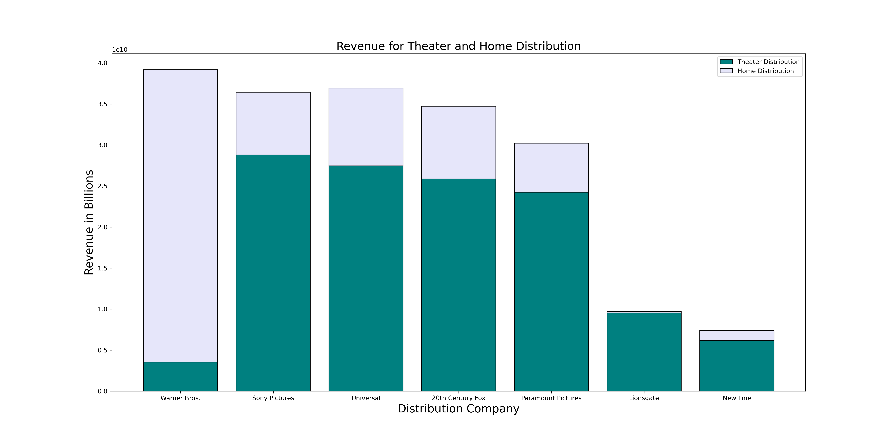
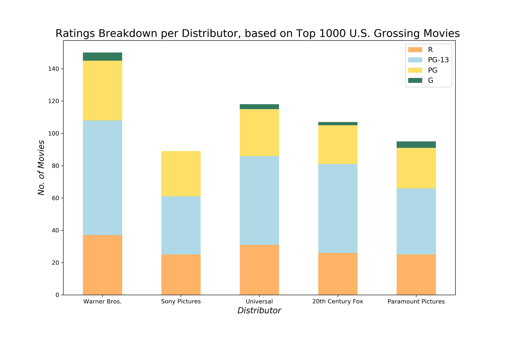

# Microsoft Movie Analysis

**Authors**: David Brown, Angela Joseph-Pauline, Catherine Fritz

## Problem


## Data Used

list what data was found and how it was cleaned


## Methodology


## Data Exploration

### Theatrical Release
Dave's Findings


Recommedation

### Home Distribution
Angel's Findings


Recommendation

### Movie Types
#### Cat's Findings
I wanted to look at the top grossing movies, get some information about them, and then compare them to the top distributors.
For the top grossing movies, I opted for data that was not adjusted for inflation to capture the movies relevant to today.
My data was captured from a table from Box Office Mojo of the top 1000 grossing movies. Each row corresponded to a movie as well as a link to further data about that movie. 

Next, I wrote a script to iterate through the rows, pull the additional data of genre tags and MPAA ratings, and then merge it with the original table pulled. 

As with the previous recommendations, we decided to omit data from Walt Disney as an outlier.

#### Genres
One of the categories I captured was the genre tags for each movie. I tallied them for each distributor and made a plot to show the most popular genres each distributor buys. In the plot below, I showed the top 10 genres and highlighted the top 3 for each distributor. I chose a pie chart to hightlight that the top 3 genres comprised the majority of the tags. I also felt this convyed the data best I did not think the absolute counts allowed the comparison between distributors as well as percentages. Further, since the top genres themselves were different for each distributer, I wanted to be able to easily find the top 3. 


#### Recommendation
Based on this data, we recommend producing an action and/or adventure movie. These two categories were universally popular for the successful movies across the top 3 distributors. Next, we recommend a comedy or drama. While these two genres were not the 3 most popular for the distributors, they were ranked somewhere in the top 4. 

#### MPAA Ratings
The next category I wanted to look at was the MPAA ratings. In the plot below I tallied the ratings for each distributor and made a plot to show the breakdown of the ratings. I chose a stacked bar chart since the same 4 ratings are used for all films and that it showed the comparison well.


#### Recommendation
Based on this data, we recommend producing a PG-13 rated movie as this comprised the majority of successful movies for the top 5 distributors. PG and R rated movies are also acceptable based on volume, however PG-13 is preferred. G rated movies are not recommended, since the top distributors do not have many or any successful G rated movies.


## Conclusion


## For More Information
Please review our full analysis in [our Jupyter Notebook](./dsc-phase1-project-template.ipynb) or our [presentation](./DS_Project_Presentation.pdf).

For any additional questions, please contact **name & email, name & email**


## Repository Structure

Describe the structure of your repository and its contents, for example:

```
├── README.md                           <- The top-level README for reviewers of this project
├── dsc-phase1-project-template.ipynb   <- Narrative documentation of analysis in Jupyter notebook
├── DS_Project_Presentation.pdf         <- PDF version of project presentation
├── data                                <- Both sourced externally and generated from code
└── images                              <- Both sourced externally and generated from code

Sli

1. Go to [this link](https://docs.google.com/presentation/d/1PaiH1bleXnhiPjTPsAXQSiAK0nkaRlseQIr_Yb-0mz0/copy) to make an editable copy of the slide deck in your own Google Drive account
2. Go to "Slide," select "Change Theme," and pick a theme you like so your presentation doesn't look like everyone else's
3. **For a group project**, click the "Share" button and add your teammates as editors

