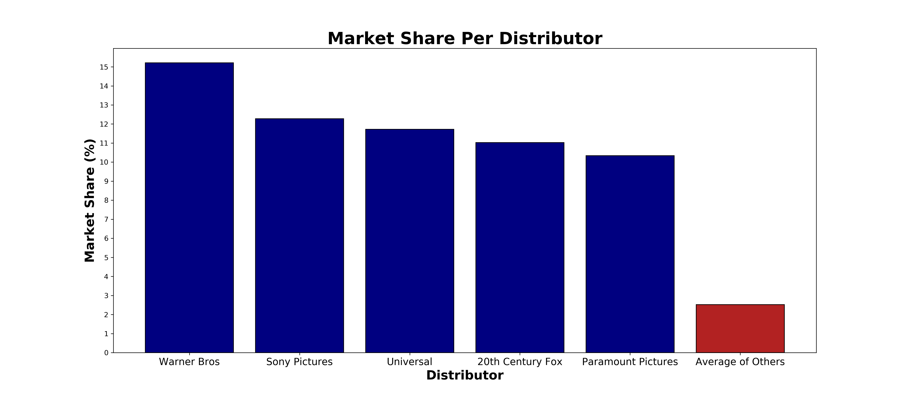
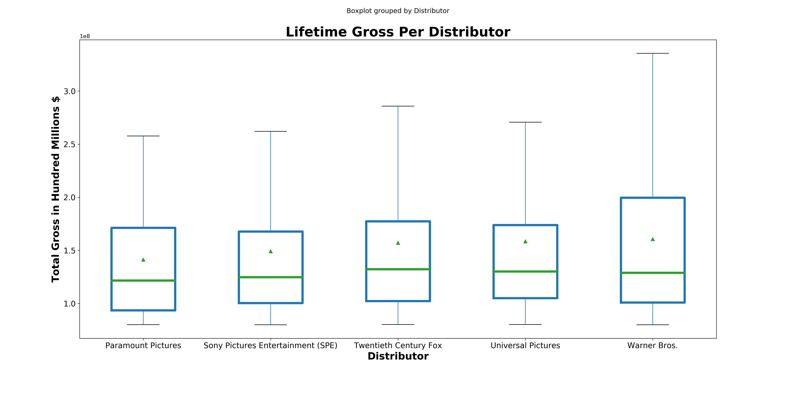
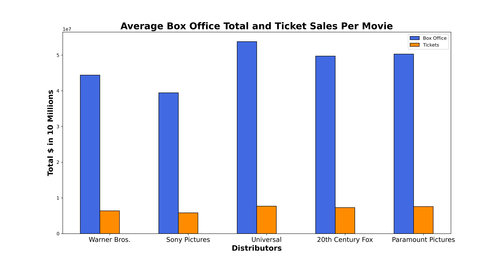
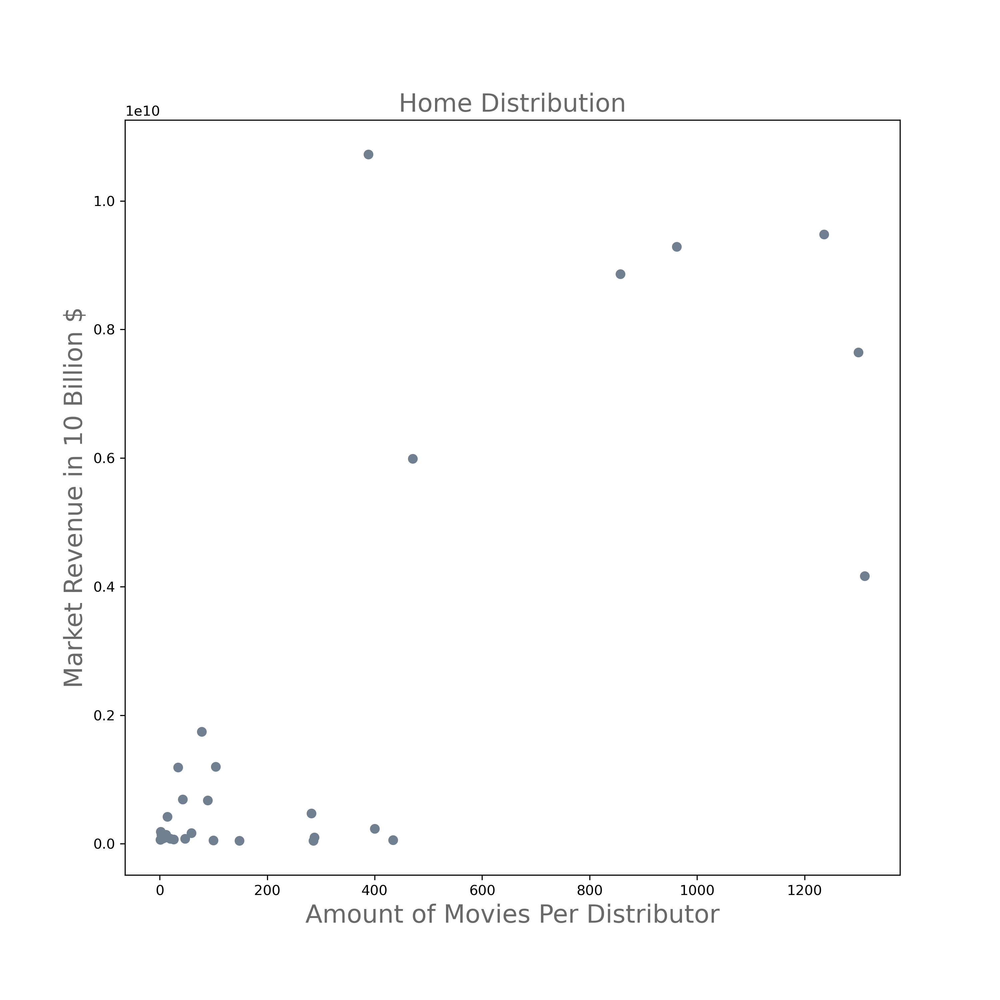
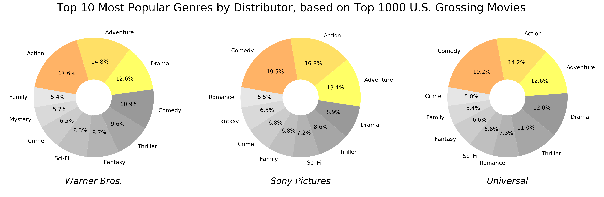

# Microsoft Movie Analysis

**Authors**: David Brown, Angela Joseph-Pauline, Catherine Fritz

## Problem


## Data Used


The data for both the theater release and home movie distributers was obtained on the-numbers.com, which hosts a plethora of data related to the movie industry. The data was presented to us in the form of a table on an html page, which was parsed and extracted. To clean the data, any numbers were converted from strings to integers or floats as necessary.


The data for the movie types was found on Box Office Mojo, which was presented as a table on an html page with further links to additional information. These pages and tables were parsed, and the data extracted. To clean the data, any fields without data were labeled as "No Data". Any numbers were converted from strings to integers or floats as necessary.


## Methodology
First, we examined the distributors' performance against other distributors for theatrical releases. Next, we looked at the same distributors performance for home movies. Lastly, we looked at the trends for the types of movies with which these top distributors were successful. 


## Data Exploration

### Theatrical Release
#### Findings
Thinking about the movie industry from a business perspecitive, we thought it would be best to focus on what Microsoft would find most appealing about creating a movie studio, the bottom line. To aid in that process, there are distribution companies that buy the rights to sell movies to theatres across the country. Our thought process was that, if Microsoft could be appealing films that the top distribution companies want to buy, they could maximize their profit.

After doing a bit of research, the team was able to find data on the top distribution companies. One showed their box office total, ticket sales, and overall market share. The other gave the lifetime gross for each of the top 500 films of all time. Using this data, we evualated each of distribution company in order to find the most appealing partner for Microsoft.

Please note, the Walt Disney Corporation was omitted from our findings because they own the movie studios and distribute their own films.

#### Market Share
Looking at one of the tables, we found that five distribution firms stood among the rest in total market share. These companies had the highest overall market share in the industry.

Warner Bros. has over 15% of the market share, while Sony (12.28%), Universal (11.72%), 20th Century Fox (11.03%), and Paramount Pictures (10.34%) are not far behind. Compare that to the average of the other distribution companies, 2.5%. If Microsoft wants a large film release, it is clear they should sell to a firm in the top 5.

#### Lifetime Gross
The next thing we looked at was the lifetime gross of the top 500 earning films of all time. We only included the top 5 distribution companies from our previous chart to compare earnings.

While each business had many films in the top 500, none of them gained an edge here. For example, most values for each firm seemed similar, except for Warner Bros. The media company appears to have largest mean, but also the largest range. Its median is in the middle of the group. The median's position could show that the range was thrown off by a few outliers. But upon a closer look, Warner Bros has the largest interquartile range. The IQR was over $98 million. The next closest IQR was $21 million lower than that. That shows that Warner Bros. films' performance vary more than others at the box office.

The other four firms have lower IQRs, meaning they are safer, but none of their mean values come within $2 million of Warner Bros. The higher the risk the higher the reward, and vice versa.

#### Box Office & Ticket Sales
The last part of the research was looking at the average performance per film for each distributor. We took the total box office and ticket sales and divided them by the number of movies the company had distributed. Now you may be thinking, box office and tickets are the same thing, but there is a key difference. Ticket sales is a known number. Distribution companies get reports from all movie theater companies that show how many times a ticket was bought to see one of their movies. Box Office is the amount of ticket revenue that came from these films. No two movie theater companies charge the same price per ticket. That is why it is important to look at both values.

From the graph, we can see that even though Warner Bros. and Sony Pictures have a larger box office total and more ticket sales than the other three, they have done so because they put out more films. The companies actually underperform per film compared to Universal, 20th Century Fox, and Paramount Pictures. From this graph, we can see that Universal Pictures is actually the company that averages the highest box office and ticket sales per film, followed by Paramount Pictures. 20th Century Fox is 3rd in both measurements.

#### Recommedation
For filmmakers that prefer large theatrical releases, we found that the top performing distributors are Universal, 20th Century Fox, and Paramount. These companies have three of the highest market shares in the industry. They have many films in the top 500 earning movies of all time. Most importantly, the average the highest box office total and ticket sales per film. If Microsoft would like to make a profit in theaters, these three companies would be the best partners.


### Home Distribution

#### Findings
We wanted to give Microsoft the opportunity to explore home distribution data. Microsoft might not want to commit to theatrical distribution leaving the home distribution market the perfect area to explore. We found a data chart on The Numbers website that showed revenue from this market between 1995 and 2020. 

Once we were able to apply this data we decided that we should compare the home distribution data with that of the theatrical box office sales. We attempted to find the best home distribution companies that have relatively similar returns. Even if Microsoft decided against theatrical distribution we wanted them to be happy with the profits they stand to make. 

#### Home Distribution 
The data indicates that the more movies that are made the more money Developers make. The research shows that Developers making between 600 and 1300 movies could make up to 9 billion dollars between 1995 and 2020. The only outlier is DIsney, which made 10 billions dollars with 388 movies made in a 20 year period. 


#### Home Distribution & Theatrical Distribution
We also compared the distributor's home distribution to their theatrical distribution. We compared Warner Bros., Sony Pictures, Universal, 20th Century Fox, Paramount Pictures, Lionsgate, and New Line. New line being the only company to make less then the above mentioned 600 movies. The data shows that Warner Bros.'s home distribution and theatrical distribution have big disparities in revenue compared to the other distribution companies. The other companies have shown similar balance to their distribution for home release and theater release. 


#### Recomendation 
We Recommend that Microsoft align with Sony Pictures, Universal, 20th Century Fox, or Paramount Pictures. All four of these companies have had over 600 movies between 1995 and 2020. They have also found a balance between releasing their movies at home and in theaters, promising the smallest amount of difference between a home release and a theatrical one. 


### Movie Types
#### Findings
We wanted to look at the top grossing movies, get some information about them, and then compare them to the top distributors.
For the top grossing movies, we opted for data that was not adjusted for inflation to capture the movies relevant to today.
Our data was captured from a table from Box Office Mojo of the top 1000 grossing movies. Each row corresponded to a movie as well as a link to further data about that movie. 

Next, we wrote a script to iterate through the rows, pull the additional data of genre tags and MPAA ratings, and then merged it with the original table pulled. 

As with the previous recommendations, we decided to omit data from Walt Disney as an outlier.

#### Genres
One of the categories we captured was the genre tags for each movie. We tallied them for each distributor and made a plot to show the most popular genres each distributor buys. In the plot below, we showed the top 10 genres and highlighted the top 3 for each distributor. We chose a pie chart to hightlight that the top 3 genres comprised the majority of the tags. We also felt this convyed the data best. We did not think the absolute counts allowed the comparison between distributors as well as the percentages. Further, since the top genres themselves were different for each distributer, we wanted to be able to easily find the top 3. 


#### Recommendation
Based on this data, we recommend producing an action and/or adventure movie. These two categories were universally popular for the successful movies across the top 3 distributors. Next, we recommend a comedy or drama. While these two genres were not the 3 most popular for the distributors, they were ranked somewhere in the top 4. 

#### MPAA Ratings
The next category we wanted to look at was the MPAA ratings. In the plot below we tallied the ratings for each distributor and made a plot to show the breakdown of the ratings. Any movies with no rating or an outdated rating of "approved" were dropped.

We chose a stacked bar chart since the same 4 ratings are used for all films and that it showed the comparison well.


#### Recommendation
Based on this data, we recommend producing a PG-13 rated movie as this comprised the majority of successful movies for the top 5 distributors. PG and R rated movies are also acceptable based on volume, however PG-13 is preferred. G rated movies are not recommended, since the top distributors do not have many or any successful G rated movies.


## Conclusion
In conclusion, we recommend that if Microsoft decides to do theatrical releases they use Universal, 20th Century Fox, or Paramount as their distribution company in order to make the best profit in theaters. Should they decide to do home distribution we also recommend the home distribution division of these companies but we also recomend Sony Pictures. For all of these distribution companies we recomend that they lean towards PG-13 movies. We also recommend that they make films in the following genres; Action/adventure, comedy, or drama. 

## For More Information
Please review our full analysis in [our Jupyter Notebook](./data/movie_data.ipynb) or our [presentation](./DS_Project_Presentation.pdf).

For any additional questions, please contact David Brown: *Email*, Angela Joseph-Pauline: *Email*, & Catherine Fritz: *Email*.


## Repository Structure

Describe the structure of your repository and its contents, for example:

```
├── README.md                           <- The top-level README for reviewers of this project
├── dsc-phase1-project-template.ipynb   <- Narrative documentation of analysis in Jupyter notebook
├── DS_Project_Presentation.pdf         <- PDF version of project presentation
├── data                                <- Both sourced externally and generated from code
└── images                              <- Both sourced externally and generated from code

Sli

1. Go to [this link](https://docs.google.com/presentation/d/1PaiH1bleXnhiPjTPsAXQSiAK0nkaRlseQIr_Yb-0mz0/copy) to make an editable copy of the slide deck in your own Google Drive account
2. Go to "Slide," select "Change Theme," and pick a theme you like so your presentation doesn't look like everyone else's
3. **For a group project**, click the "Share" button and add your teammates as editors

